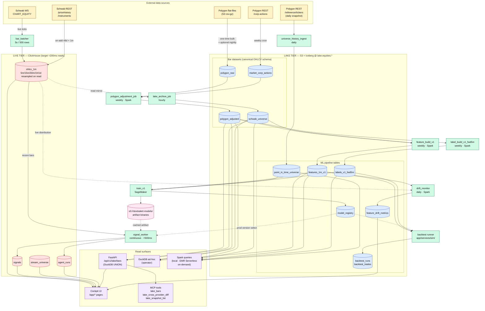

# 01 — System Architecture

## TL;DR

Two tiers, three lake datasets, one canonical universe table.

```
LIVE TIER (ClickHouse) — user-facing charting, indicators, screener, sim.
LAKE TIER (S3 + Iceberg) — analytical / ML training workloads.

Datasets:
  equities.polygon_raw       — whole-market 5y Polygon flat-files, RAW, immutable
  equities.polygon_adjusted  — whole-market 5y, SPLIT-ADJUSTED (one-time + corp-action incrementals)
  equities.schwab_universe   — Schwab 1-min bars, ALREADY ADJUSTED by Schwab, grows live
```

**Schwab data needs no adjustment math** — Schwab returns split-adjusted
bars natively. The corp-actions adjustment ETL applies only to the
Polygon historical archive (one-time build + incremental on new corp
actions).

**No "bronze → silver → derived CH" pipeline on the live path.**
Schwab REST + WS write directly to CH for charting. Schwab live also
flushes to the lake on the side for the ML training dataset to grow
over time.

**Spark + Iceberg first-class** for production batch ML jobs.
DuckDB for ad-hoc single-user queries.

## Comprehensive flow diagram

End-to-end view of v2 — every external source, every tier, every
compute job, every read surface. Colour-coded by layer; solid arrows
are writes / data flow; dotted arrows are read-only / cache loads.



### Legend

| Colour | Layer |
|---|---|
| Amber | External data sources (Schwab, Polygon) |
| Red | Live tier — ClickHouse tables (powering cockpit + inference) |
| Blue | Lake tier — Iceberg tables at `lake.equities.*` |
| Green | Compute — batch jobs (Spark / SageMaker / cron) + the signal worker |
| Purple | Read surfaces — cockpit, HTTP endpoint, MCP tools, ad-hoc engines |
| Pink | Model artifact storage (`s3://stockalert-models/`) |

### Three flow narratives to read off the diagram

1. **Live charting path** — `Schwab WS → bar_batcher → ohlcv_1m → Cockpit`.
   Sub-200ms; zero Iceberg dependency on the request path. The dotted
   edge `ohlcv_1m → lake_archive_job` is the side-effect that builds
   `schwab_universe` for ML.

2. **Polygon adjustment path** — `Polygon flat-files → polygon_raw`
   (one-time) + `Polygon /corp-actions → market_corp_actions` (weekly)
   → `polygon_adjustment_job` → `polygon_adjusted`. This is the
   computed adjusted history that feeds both deep-history chart
   queries (via `/api/v1/lake/bars`) and ML feature engineering.

3. **ML loop** — `polygon_adjusted` + `schwab_universe` → feature/
   label builds → `train_v1` (SageMaker) → `model_registry` +
   `s3://stockalert-models/`. The signal worker on the live tier
   loads the prod-status model and writes `signals`. Train/serve
   parity is enforced by importing the **same** `app/ml/features/v1.py`
   in both the Spark feature build and the signal worker.

### What's not shown

- Schema details — see [02_schema.md](02_schema.md).
- Partition layout / file sizing — see [03_s3_layout.md](03_s3_layout.md).
- Spark session config + EMR Serverless escape hatch — see [04_spark.md](04_spark.md).
- Failure-isolation matrix (which paths break under each outage) — see the [Failure isolation](#failure-isolation) section below.
- Migration phase ordering — see [06_migration.md](06_migration.md).

## The two tiers

### Tier 1 — Live (ClickHouse)

Powers everything the user clicks on. Built for sub-200ms queries
across any zoom level.

| Table | Contents | Source | Adjusted? |
|---|---|---|---|
| `ohlcv_1m` | 1-min bars for `stream_universe` symbols; the only CH OHLCV table — all chart timeframes (5m/15m/30m/1h/1d) are resampled from it on read | Schwab WS (live) + Schwab REST (on-add 48d) | yes (Schwab native) |
| `stream_universe` | Canonical "what's actively streamed" | Cockpit Stream Service page | n/a |
| `watchlists`, `watchlist_members` | User-organizing labels | Cockpit | n/a |
| `signals`, `agent_runs` | App state (signals + sim/backtest run records) | App | n/a |

The chart endpoint reads ONLY from ClickHouse. No Iceberg dependency
on the live request path. Resamples to 5m/15m/30m/1h/4h via
`toStartOfInterval()` at query time.

### Tier 2 — Lake (S3 + Iceberg)

Powers ML training, backtesting, deep-history analytics. Optimized
for cluster-scale batch reads via Spark, single-user reads via DuckDB.

| Table | Contents | Source | Adjusted? |
|---|---|---|---|
| `equities.polygon_raw` | Polygon flat-files, **whole-market** | one-time bulk + optional periodic | **no (raw)** |
| `equities.polygon_adjusted` | Polygon, whole-market, **split-adjusted** | computed by `polygon_adjustment_job` | **yes** |
| `equities.schwab_universe` | Schwab live + REST tip-fill mirror | `lake_archive_job` hourly | **yes (Schwab native)** |
| `equities.market_corp_actions` | Splits + dividends, whole-market | Polygon REST corp-actions ingest, weekly | n/a |

Detailed S3 layout + partition strategy: [03_s3_layout.md](03_s3_layout.md).
Schema definitions + DDL: [02_schema.md](02_schema.md).

## Ingest paths

### A. Live charting (real-time, universe)

```
Schwab CHART_EQUITY WebSocket
        │
        ▼
   bar_batcher (5s / 500 rows)
        │
        ▼
   CH.ohlcv_1m  (source = "schwab-live")
        │
        │ lake_archive_job (every 1 hour)
        ▼
   equities.schwab_universe   (Iceberg)
```

- CH is the source of truth for live charting.
- Iceberg lake mirrors CH for ML training continuity.
- Both adjusted (Schwab native, no math).

### B. On-add fast path (single symbol)

```
POST /api/v1/stream {"symbol": "PG"}
        │
        ▼
   stream_universe row written
        │
        ▼
   schwab_provider.subscribe_bars(["PG"])      → CH.ohlcv_1m forward (live)
        │
        ▼
   schwab_rest_pricehistory(PG, 48d × 1m)        → CH.ohlcv_1m       ~1-2s

   Total wall-clock: ~3-5s. Chart usable at every zoom (5m/15m/30m/1h/1d
   resampled from ohlcv_1m on read).
```

For data deeper than 48 days for the new symbol: lazy query of
`equities.polygon_adjusted` via DuckDB at chart-render time, resampled
to the requested timeframe. Most users never hit this.

### C. Polygon historical (one-time + incremental)

```
ONE-TIME BULK (already done):
   Polygon flat-files (5y whole-market)
        ▼
   equities.polygon_raw   (Iceberg, RAW)

ONE-TIME ADJUSTMENT BUILD (Phase 1 of v2 migration):
   equities.polygon_raw + equities.market_corp_actions
        ▼
   polygon_adjustment_job (Spark batch)
        ▼
   equities.polygon_adjusted   (Iceberg, ADJUSTED, whole-market)

INCREMENTAL (when new corp actions land):
   Polygon REST corp-actions ingest (weekly cron)
        ▼
   equities.market_corp_actions   (Iceberg)
        ▼
   polygon_adjustment_job --since <date>   (re-adjusts only affected symbols)
        ▼
   equities.polygon_adjusted   (updated for affected symbols)
```

The adjustment job runs:
- **Once** after the initial 5y bulk load.
- **Weekly** via EMR Serverless cron to incorporate new corp actions.
- **On-demand** when an operator triggers it via CLI.

### D. (Optional) Ongoing Polygon flat-file refresh

If the operator wants `equities.polygon_raw` to keep growing (vs frozen
at the bulk-load date), the existing `nightly_polygon_refresh` job
can stay enabled. It writes yesterday's whole-market flat-file into
`equities.polygon_raw` (then triggers an incremental adjustment).

Disabled by default in v2 — adds Polygon subscription cost without
clear ROI for live charting (Schwab covers the universe). Re-enable
if you want continuous whole-market ML data.

## Read paths

### Live API (FastAPI) — reads CH only

```python
# routes_market.py
bars = await asyncio.to_thread(
    queries.list_bars_resampled,
    symbol, interval, start, end, limit,
    source_table="ohlcv_1m",   # canonical resolution
)
```

ClickHouse SQL with on-the-fly `toStartOfInterval()` resampling.
<200ms for any zoom level. **Zero Iceberg / S3 dependency** on the
chart request path.

### Operator ad-hoc — DuckDB

```python
import duckdb

# Single-symbol deep history
df = duckdb.sql("""
    SELECT * FROM iceberg_scan('s3://{your-bucket}/equities/polygon_adjusted/')
    WHERE symbol = 'AAPL'
      AND timestamp BETWEEN '2020-01-01' AND '2024-12-31'
""").df()
```

DuckDB reads Iceberg natively. Symbol-bucket partitioning makes
single-symbol queries fast (~1-3s for 5y of 1-min data).

### Cockpit deep history + Agent — `/api/v1/lake/bars` + MCP (Phase 4+)

The same DuckDB read path is wrapped two ways:

1. **HTTP endpoint** `GET /api/v1/lake/bars?symbol=...&start=...&end=...`
   — cockpit chart falls back here when the zoom range exceeds CH
   retention. UNION across `equities.polygon_adjusted` +
   `equities.schwab_universe` with `source` preserved for audit.
2. **MCP tools** (`app/mcp/tools.py`) — the assistant agent calls
   `lake_bars`, `lake_cross_provider_diff`, `lake_snapshot_list`
   directly. Same DuckDB query under the hood. Gate 7 decision —
   the agent surface ships in the same commit batch as the HTTP
   endpoint (CV11/CV12/CV12b in [06_migration.md](06_migration.md)).

DuckDB cold-start: ~500ms first request, ~50ms cached. Acceptable
for deep-history fall-through; not on the hot chart path.

### ML training — Spark

For cluster compute. Same Iceberg tables, scaled out.

```python
spark.sql("""
    SELECT * FROM lake.equities.polygon_adjusted
    VERSION AS OF 1234567890   -- snapshot pinned for reproducibility
    WHERE timestamp BETWEEN '2020-01-01' AND '2024-12-31'
""").write.parquet("s3://stockalert-features/train_v1/")
```

Full Spark setup + query examples in [04_spark.md](04_spark.md).

## Failure isolation

Live tier and lake tier are independent. Either can fail without
breaking the other.

| Failure | Live tier | Lake / ML |
|---|---|---|
| Schwab outage | Live ticks stop; chart shows last bar + "stale" badge | Unaffected; reads existing snapshots |
| Schwab token expired | Same; OAuth refresh needed | Unaffected |
| Polygon subscription ends | Unaffected (Schwab only on live tier) | `equities.polygon_raw` frozen at last refresh; existing snapshots queryable forever. `schwab_universe` keeps growing |
| ClickHouse down | Live API 503s | Unaffected |
| CH corrupted | Restore from `equities.schwab_universe` (~1 hour for universe) | n/a |
| S3 region outage | Unaffected (CH local) | ML pipelines pause |
| Glue catalog down | Unaffected | Iceberg writes fail; direct S3 reads of known snapshots still work |
| Bad corp-action data | Unaffected | Next adjustment-job run repairs the symbol |

**No single component is on the critical path for both live and ML
workloads.**

## Why the medallion vocabulary is retired

In v1, the layers were named by their POSITION in the pipeline
(`bronze`/`silver`/`derived`). v2 names them by WHAT THEY CONTAIN:

| v1 | v2 | What it actually contains |
|---|---|---|
| `bronze.polygon_minute` | `equities.polygon_raw` | Polygon flat-file bars, untouched |
| `bronze.schwab_minute` | merged into `equities.schwab_universe` | Schwab bars (already adjusted) |
| `silver.ohlcv_1m` | `equities.polygon_adjusted` + `equities.schwab_universe` | Computed adjusted (Polygon) or pass-through (Schwab) |
| `bronze.polygon_corp_actions` | `equities.market_corp_actions` | Splits + dividends |

The medallion vocabulary obscured a real semantic split: Schwab data
is adjusted by the provider; Polygon raw is unadjusted; the
adjustment is a **provider-specific concern**, not a pipeline layer.
v2 makes that explicit.

## What stays exactly as in v1

- `stream_universe` table is the canonical "what we hot-cache."
- Sticky-universe model (cockpit Stream Service page).
- `WatchlistService` (CRUD-only, with auto-extend hook to stream).
- `DataProvider` interface (Schwab today; pluggable for Alpaca, Yahoo, etc.)
- ClickHouse for live tier.
- S3 + Iceberg for lake.
- All cockpit pages.
- The job registry (visible on `/app/status`).

## What goes away from the daily critical path

- `silver_ohlcv_build` nightly job (becomes weekly `polygon_adjustment_job` instead).
- Bronze / silver as separate Iceberg tables (renamed; merged where adjusted).
- The "live tier reads from silver-derived CH" indirection.
- `silver_to_ch_refresh` (deferred in v1; not needed in v2).
- CH `ohlcv_5m` / `ohlcv_daily` cache tables (retired 2026-06 — chart resamples 5m/15m/30m/1h/1d from `ohlcv_1m` at query time).
- Schwab REST nightly (universe coverage comes from WS + on-add tip-fill).

## See also

- [02_schema.md](02_schema.md) — Iceberg DDL + canonical OHLCV columns
- [03_s3_layout.md](03_s3_layout.md) — Concrete paths + partitioning
- [04_spark.md](04_spark.md) — PySpark setup + real queries
- [05_providers.md](05_providers.md) — DataProvider interface
- [06_migration.md](06_migration.md) — 5-phase migration plan
- [07_runbook.md](07_runbook.md) — Operator procedures
- [08_decisions.md](08_decisions.md) — Open approval gates
