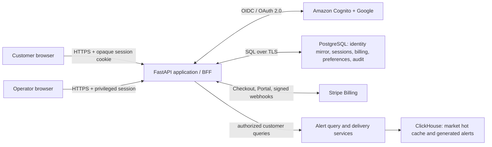

# Customer Identity, Dashboard Access, and Subscription System

**Status:** Draft requirements for approval

**Version:** 0.1

**Date:** 2026-06-19

**Scope:** Production customer identity, authentication, authorization,
subscriptions, and separation from the StockAlert operator cockpit

**Implementation status:** Foundation slice started on `codex/dashboard-auth`:
Pydantic identity contracts, provider/repository Protocols, SQLAlchemy models,
Alembic schema, opaque session primitives, and lightweight PostgreSQL Docker
configuration. The next slice adds Cognito OAuth/PKCE, validated callback,
opaque cookies, CSRF-protected logout, current-user contract, and deny-by-
default customer/operator dependencies. Stripe remains unimplemented.

This document defines the initial system contract. It is a plan, not
authorization to implement it. Requirements will evolve, but implementations
must preserve the security and service boundaries defined here unless this
specification is revised first.

## 1. Product intent

StockAlert will eventually sell subscriptions to trading-system alerts and a
customer-facing dashboard. A customer must be able to create an account, sign
in, manage account security, purchase a subscription, and see only the
features and data allowed by that account and subscription.

The customer dashboard is a different product surface from the existing
developer/operator cockpit. A customer must never gain operator access merely
because they can authenticate successfully or hold a paid subscription.

The first production target is hundreds of users. The design must avoid
unnecessary infrastructure at that scale while allowing growth without an
identity or data-model rewrite.

## 2. Goals

- Support local account creation with a verified email address and password.
- Support Google sign-in.
- Support optional customer two-factor authentication (2FA), initially using
  authenticator-app TOTP codes.
- Require MFA for privileged administrator and developer accounts.
- Support secure self-service password reset and account recovery.
- Maintain durable user, tenant, login-session, subscription, entitlement,
  preference, and audit records outside ClickHouse.
- Use Stripe for checkout, recurring subscriptions, billing management, and
  subscription lifecycle events.
- Enforce strict separation among public, customer, and operator interfaces.
- Define every application interface with versioned Pydantic models.
- Create and evolve relational schemas from checked-in code and migrations.
- Run application services as Docker containers in development and
  production.
- Prefer low-cost managed AWS services when they materially reduce security or
  operational risk.

## 3. Non-goals for the first release

- Building or storing a custom password-verification system in StockAlert.
- Supporting enterprise SAML, organization-managed SSO, or SCIM provisioning.
- Supporting multiple billing providers.
- Creating a marketplace or allowing users to resell alerts.
- Storing payment card details in StockAlert.
- Moving market data, trading calculations, or alert generation into the
  customer identity database.
- Giving customer clients direct access to PostgreSQL, ClickHouse, or AWS
  credentials.

## 4. Initial architecture decisions

### 4.1 Identity provider: Amazon Cognito User Pools

Use Amazon Cognito User Pools as the production credential and identity
provider. Cognito must own password verification, Google federation, email
verification, reset codes, MFA secrets, token issuance, and credential
revocation. StockAlert must not store plaintext passwords, recoverable
passwords, password hashes, Google access tokens, TOTP secrets, or reset codes
in its application database.

Use the Cognito Essentials tier initially. As of this document's date, AWS
includes direct and social-provider users in an indefinite free tier of 10,000
monthly active users for Lite and Essentials. That is well above the initial
hundreds-of-users target. Pricing and tier capabilities must be rechecked
before production launch.

Use Cognito managed login with OAuth 2.0 Authorization Code flow and PKCE for
the first release. This reduces the amount of security-sensitive UI and flow
logic maintained by StockAlert. Branding may be customized within Cognito's
supported controls.

### 4.2 Operational database: PostgreSQL

Use PostgreSQL for StockAlert-owned customer and billing data.

- Development and CI: an official PostgreSQL Docker container.
- Initial production: Amazon RDS for PostgreSQL on a current, supported
  Graviton burstable instance class, sized from load tests.
- Paid general availability: Multi-AZ, encrypted storage, automated backups,
  point-in-time recovery, private subnets, and no public database endpoint.
- Growth option: migrate to Aurora PostgreSQL or Aurora Serverless v2 only
  when measured connection, availability, or scaling needs justify its higher
  baseline complexity or cost.

Ordinary RDS PostgreSQL is preferred initially because a continuously
available application with hundreds of users does not need Aurora's scaling
envelope. Both targets remain PostgreSQL-compatible, so this choice does not
change application contracts or migrations.

### 4.3 Session pattern: backend-for-frontend

The browser must receive only an opaque session identifier in a cookie. The
FastAPI backend exchanges Cognito authorization codes, validates tokens, and
maintains the application session.

- Cookie attributes: `Secure`, `HttpOnly`, `SameSite=Lax`, host-only, and a
  narrowly scoped path where practical.
- The browser must not store Cognito access or refresh tokens in
  `localStorage` or other JavaScript-readable persistent storage.
- PostgreSQL stores only a cryptographic hash of the opaque session ID plus
  session metadata. If a Cognito refresh token must be retained, it must be
  envelope-encrypted with AWS KMS before storage.
- Access tokens are short-lived. Refresh-token rotation is enabled.
- Logout revokes the provider session where supported, deletes the server
  session, and expires the browser cookie.
- Password changes, account disablement, suspected compromise, and privileged
  role changes revoke all active StockAlert sessions for that user.

### 4.4 Billing provider: Stripe Billing

Use Stripe Checkout to start subscriptions and Stripe's hosted Customer Portal
to manage payment methods, invoices, plan changes, and cancellation. Stripe
stores all cardholder data. StockAlert stores only Stripe identifiers and the
subscription state required for authorization and support.

Stripe webhook events are the authoritative source for asynchronous billing
state changes. Browser redirects after checkout are never authoritative.

## 5. System boundaries

### 5.1 Product surfaces

| Surface | Suggested path | Audience | Authorization |
|---|---|---|---|
| Public pages and auth entry | `/`, `/login`, `/signup`, `/auth/*` | Anyone | Public, rate-limited |
| Customer dashboard | `/app/*` | Customers | Authenticated account plus feature entitlement |
| Customer API | `/api/v1/customer/*` | Customer dashboard | Customer principal and tenant scope |
| Operator cockpit | `/admin/*` | Staff only | Explicit staff role plus mandatory MFA |
| Operator API | `/api/v1/admin/*` | Operator cockpit | Explicit permission; deny by default |
| Stripe webhook | `/webhooks/stripe` | Stripe only | Verified Stripe signature; no browser session |
| Health checks | `/health` | Infrastructure | Public but contains no secrets or customer data |

The current developer cockpit is expected to move from `/app` to `/admin`
when the customer dashboard is introduced. Development mode may provide an
explicit local principal, but production must have no auth-bypass setting.

### 5.2 Data ownership

| System | Owns | Must not own |
|---|---|---|
| Cognito | Credentials, federated identities, verification state, MFA factors, provider tokens | Billing state, dashboard preferences, trading data |
| PostgreSQL | User mirror, tenants, memberships, roles, sessions, Stripe references, subscriptions, entitlements, alert preferences, audit records | Passwords, TOTP secrets, card data, market time series |
| Stripe | Customers, payment methods, invoices, charges, canonical billing events | Dashboard authorization by itself |
| ClickHouse | Market-data hot cache, generated signals/alerts, analytical event data | Credentials, login sessions, account profiles, payment data |

ClickHouse failures must not corrupt identity or billing data. PostgreSQL
failures must fail customer authorization closed; they must not expose
unscoped ClickHouse data.

## 6. Identity and access requirements

### 6.1 Registration and identity linking

- A customer can register using a verified email address and password.
- A customer can sign in with Google through Cognito federation.
- Email is the primary sign-in and recovery identifier. A mutable display name
  may be chosen by the user; it is not an authentication secret.
- Emails are normalized for lookup and uniqueness without changing the address
  sent to Cognito or Stripe.
- Registration requires acceptance of the current Terms of Service and Privacy
  Policy versions, with acceptance time and document versions audited.
- A verified Google identity and a password identity with the same email must
  not be silently merged. Linking requires a freshly authenticated session and
  proof of control of both identities, or an audited support workflow.
- Account and tenant IDs are opaque UUIDs generated by StockAlert. Cognito's
  immutable `sub` claim is stored as an external identity reference, never as
  a user-editable identifier.
- Duplicate webhook delivery, callback replay, or repeated registration calls
  must be idempotent.

### 6.2 Sign-in and sign-out

- Successful authentication creates a server-side StockAlert session and an
  opaque browser cookie.
- Unauthenticated access to a protected page redirects to login and returns to
  the original same-origin destination after success.
- Redirect destinations must be allowlisted or validated as relative paths to
  prevent open redirects.
- Account-disabled, tenant-disabled, and session-revoked states deny access
  even when an upstream token has not yet expired.
- Error responses must not reveal whether an email address is registered.
- Sign-in, sign-out, failed authentication, recovery, MFA changes, session
  revocation, and identity linking are security audit events.

### 6.3 Two-factor authentication

- Customer MFA is optional in the initial release and can be enabled from
  account security settings.
- The initial customer factor is TOTP through an authenticator application.
- TOTP enrollment requires a recent primary authentication and confirmation
  with a valid code before activation.
- Recovery codes or an audited account-recovery path must exist before MFA is
  offered as generally available. Recovery codes, if implemented by
  StockAlert, are random, one-time use, stored only as strong hashes, and shown
  once.
- Disabling or replacing MFA requires recent authentication and creates a
  security notification and audit event.
- Administrator and developer accounts require MFA.
- For Google-federated users, Cognito delegates authentication and MFA to
  Google. Cognito does not add its own TOTP challenge to that federated login.
  A future requirement for StockAlert-controlled MFA after Google login would
  require a separate step-up authentication design.

### 6.4 Password and recovery requirements

- Password policy and breach protections are configured in Cognito, not
  reimplemented in FastAPI.
- Password reset uses single-use, time-limited Cognito recovery codes sent only
  to verified recovery channels.
- Reset initiation and responses are enumeration-resistant and rate-limited.
- A successful password reset revokes all StockAlert sessions and sends a
  security notification.
- Support personnel cannot view, retrieve, or set a known permanent customer
  password. Administrative reset flows issue a temporary recovery action.
- Users authenticated exclusively through Google do not have a StockAlert
  password to reset; the UI must direct them to the correct provider.

### 6.5 Authorization and tenancy

- Authentication answers who the caller is; authorization independently
  decides what the caller may do.
- Every customer belongs to at least one tenant/account through a membership.
  The initial UI may create one personal tenant per user.
- Roles and subscription entitlements are server-derived. The API must ignore
  client-supplied `user_id`, `tenant_id`, role, plan, or entitlement claims.
- Every tenant-owned PostgreSQL query includes a tenant scope. Repository and
  service APIs accept a `Principal` rather than a naked caller-supplied tenant
  ID.
- PostgreSQL row-level security should provide defense in depth for
  tenant-owned tables after the connection-scoping strategy is proven in
  integration tests.
- Admin access is granted by explicit staff membership and fine-grained
  permissions, not by a customer plan name.
- A paid subscription never grants developer or operator privileges.
- Data from ClickHouse is returned only through services that apply customer,
  subscription, symbol/universe, and feature-entitlement rules.
- Access is denied by default when subscription or entitlement state cannot be
  determined.

## 7. Subscription and entitlement requirements

### 7.1 Checkout and customer mapping

- The backend creates Stripe Checkout Sessions; the browser cannot choose an
  arbitrary internal price or entitlement.
- Price IDs are selected from a server-side plan catalog.
- One StockAlert tenant maps to one Stripe Customer for the initial release.
- Stripe Customer, Subscription, Price, Checkout Session, and relevant Invoice
  IDs are stored as external references.
- Stripe object metadata may contain opaque StockAlert IDs, but never secrets,
  credentials, or sensitive trading preferences.

### 7.2 Webhooks and state projection

- Verify the Stripe signature against the exact raw request body before JSON
  parsing or Pydantic validation.
- Persist each Stripe event ID before processing. Duplicate events return
  success without applying state twice.
- Webhook processing is transactionally idempotent and tolerant of out-of-order
  delivery.
- Store the last applied Stripe object version/time and retrieve the current
  Stripe object when event ordering is ambiguous.
- Acknowledge webhooks quickly. Retriable work may be placed on a durable queue
  after the event is recorded.
- Subscription status and product/price mapping produce internal entitlements.
  Customer API authorization reads internal entitlements, not browser state.
- Define explicit policy for `trialing`, `active`, `past_due`, `unpaid`,
  `paused`, `canceled`, and `incomplete` statuses before launch.
- The default grace-period recommendation is limited access for a short,
  configurable period after a recoverable payment failure; cancellation or
  fraud revocation takes effect immediately.

### 7.3 Billing management

- Customers use Stripe's hosted Customer Portal for payment methods, invoices,
  plan changes, and cancellation.
- The portal is opened through a short-lived, server-created portal session.
- Billing pages clearly distinguish authentication state, subscription state,
  and feature entitlement state.
- Refunds, disputes, charge failures, cancellations, and plan changes create
  audit records and user notifications where appropriate.

## 8. Application contracts and schemas

### 8.1 Pydantic contracts

All boundaries use Pydantic v2 models:

- HTTP request and response bodies.
- The authenticated `Principal` and authorization decision inputs.
- Service-to-service commands and results.
- Stripe event projections after signature verification.
- Queue messages and domain events.
- Configuration loaded from environment variables or secret references.
- Structured audit and security events.

Generated OpenAPI is the frontend contract. TypeScript types are generated
from OpenAPI; handwritten duplicate API types are prohibited unless a protocol
cannot be represented by OpenAPI, such as streaming events, in which case the
Pydantic event model remains authoritative and a contract test verifies the
frontend mirror.

Suggested core models include:

- `Principal(user_id, tenant_id, session_id, roles, permissions, entitlements)`
- `CurrentUserResponse`
- `TenantResponse` and `MembershipResponse`
- `AuthCallbackCommand` and `SessionResponse`
- `SubscriptionResponse` and `EntitlementResponse`
- `CreateCheckoutSessionRequest/Response`
- `CreateBillingPortalSessionResponse`
- `SecurityEvent` and `AuditEvent`
- `ErrorResponse(code, message, details, request_id)`

No model returned to a browser may contain password material, Cognito tokens,
session hashes, KMS ciphertext, Stripe secrets, internal authorization notes,
or other users' personal data.

### 8.2 Relational schema management

- SQLAlchemy 2 declarative models define persistence mappings.
- Alembic migrations checked into source control are the only production
  schema-change mechanism.
- A new environment is fully creatable from migration code without manual SQL.
- Migrations are forward-reviewed, tested against an empty database and a copy
  of the prior schema, and backed up before destructive production changes.
- Application startup must not silently mutate production schemas.
- Pydantic domain/API models remain separate from SQLAlchemy persistence
  models; explicit mapping prevents accidental exposure of private columns.

### 8.3 Minimum relational entities

| Entity | Purpose |
|---|---|
| `users` | StockAlert user profile, status, verified contact mirror, timestamps |
| `external_identities` | Cognito `sub`, provider type, provider subject, link state |
| `tenants` | Personal or future organization account |
| `memberships` | User-to-tenant role and status |
| `sessions` | Hashed opaque session ID, encrypted provider material if required, expiry, revocation, device metadata |
| `plans` | Internal plan catalog and version |
| `plan_entitlements` | Features and limits granted by a plan |
| `stripe_customers` | Tenant-to-Stripe Customer mapping |
| `subscriptions` | Projected Stripe subscription state and period boundaries |
| `tenant_entitlements` | Effective, queryable entitlement snapshot |
| `alert_preferences` | Tenant/user delivery and filtering choices |
| `terms_acceptances` | Legal document versions and acceptance evidence |
| `processed_webhook_events` | Stripe event idempotency and processing state |
| `security_events` | Authentication and account-security audit trail |
| `audit_events` | Privileged and business-sensitive actions |

Tables containing personal or tenant-owned data include stable IDs,
`created_at`, `updated_at`, and appropriate deletion/status fields. Sensitive
fields are classified and retention periods are documented before launch.

## 9. Security requirements

### 9.1 Transport, encryption, and secrets

- TLS 1.2 or newer is required for all public and service connections.
- HTTPS is enforced with HSTS after domain rollout is verified.
- RDS storage, snapshots, backups, and sensitive session ciphertext are
  encrypted with AWS KMS.
- Database connections require TLS certificate validation.
- Secrets live in AWS Secrets Manager or an equivalent approved secret store;
  they are never committed to source, baked into images, logged, or returned
  by health endpoints.
- Production IAM uses least-privilege task roles and short-lived credentials.
- Encryption keys and secrets have documented rotation and incident-revocation
  procedures.

### 9.2 Web and API controls

- State-changing cookie-authenticated requests require CSRF protection in
  addition to `SameSite` cookies.
- Apply a restrictive Content Security Policy and standard security headers.
- Validate OAuth `state`, PKCE verifier/challenge, issuer, audience, signature,
  expiry, and nonce where applicable.
- Rate-limit registration, login initiation, callback failures, recovery,
  MFA, session creation, checkout creation, and webhook endpoints.
- Use generic authentication errors and bounded response sizes.
- Validate all inputs through Pydantic and parameterize all SQL.
- Apply origin checks to WebSocket handshakes and authenticate before accepting
  subscriptions.
- SSE and WebSocket connections terminate when their session is revoked or
  expires and never subscribe to unauthorized tenant topics.
- Logs redact cookies, authorization headers, tokens, codes, secrets, payment
  data, and sensitive PII.

### 9.3 Audit, privacy, and operations

- Security events include actor, tenant, action, result, time, request ID,
  coarse client/network context, and target resource without recording secrets.
- Privileged actions are tamper-evident and retained separately from routine
  application logs.
- Define retention and deletion policies for profiles, sessions, IP addresses,
  audit events, and billing records before accepting public registrations.
- Provide account disablement, data export, and deletion workflows consistent
  with applicable law and required financial-record retention.
- Production access to personal data is limited, audited, and reviewed.
- Backups and restore procedures are tested, not merely enabled.
- Maintain incident response procedures for credential compromise, Stripe
  webhook-secret compromise, database exposure, and tenant-isolation failure.
- Dependency, container-image, and source scanning run in CI; critical findings
  block release.

## 10. Availability, scaling, and performance

- The target is at least hundreds of registered and concurrently intermittent
  customer accounts without architecture changes.
- Application containers are stateless except for ephemeral in-request data.
  Any instance can serve any authenticated request.
- Use bounded PostgreSQL connection pools. Add RDS Proxy only when connection
  measurements or highly elastic container counts justify its additional cost.
- Identity and billing writes are transactional. Alert reads may degrade
  independently without affecting account integrity.
- Target customer API availability and recovery objectives must be finalized
  before paid launch. Initial recommendation: Multi-AZ RDS, automated backups,
  a tested point-in-time restore, and at least two application tasks across
  Availability Zones.
- Load tests cover login callback/session creation, dashboard startup,
  entitlement checks, webhook bursts, and reconnect storms.
- Rate limits and service quotas are monitored before marketing or onboarding
  events.

## 11. Deployment and configuration

- FastAPI/customer API, background workers, and the React frontend build are
  reproducible from versioned Dockerfiles.
- Local `docker compose` starts PostgreSQL and application dependencies with
  non-production credentials. Cognito may use a dedicated AWS development user
  pool because no official local Cognito runtime exists.
- The identity provider is accessed behind narrow application interfaces:
  `IdentityProvider`, `SessionStore`, and `AuthorizationService`. These seams
  support deterministic fakes in tests; they are not a promise to support
  arbitrary providers in production.
- Configuration is environment-specific and validated with Pydantic Settings.
  Startup fails clearly when production-required security settings are absent.
- Development convenience flags are structurally unavailable or rejected in a
  production environment.
- Schema migrations run as an explicit deployment task before compatible
  application containers receive traffic.
- Production uses separate AWS resources and secrets for development, staging,
  and production.

## 12. Required user flows

### 12.1 Email/password registration

1. User chooses email/password registration.
2. Cognito creates an unconfirmed identity and sends verification.
3. User verifies the email.
4. FastAPI completes the callback and transactionally creates or reconciles the
   StockAlert user, personal tenant, membership, and session.
5. User accepts current legal terms if not already recorded.
6. User enters the customer dashboard with free/trial entitlements.

### 12.2 Google registration or login

1. User selects Google.
2. Cognito redirects to Google using OAuth/OIDC.
3. Cognito validates the provider response and issues its authorization result.
4. FastAPI validates the callback and creates or reconciles the StockAlert
   identity mapping and session.
5. A possible collision with an existing password account enters a secure
   linking flow rather than silently merging accounts.

### 12.3 Optional TOTP enrollment

1. Authenticated password user reauthenticates.
2. Cognito provides an enrollment secret rendered as QR/manual key.
3. User submits a current TOTP code.
4. Cognito confirms the factor; StockAlert records only non-secret enrollment
   status and the security event.
5. Recovery capability is confirmed before the flow completes.

### 12.4 Password reset

1. User submits an email to the recovery flow.
2. The response is identical whether or not the account exists.
3. Cognito sends a time-limited code to the verified recovery channel.
4. User sets a new password through Cognito.
5. StockAlert revokes existing application sessions and notifies the user.

### 12.5 Subscription purchase

1. Authenticated user selects a server-defined plan.
2. Backend creates or reuses the Stripe Customer and creates Checkout Session.
3. User completes payment on Stripe.
4. Stripe sends signed webhook events.
5. StockAlert records the event, projects subscription state, and recomputes
   entitlements transactionally.
6. Dashboard access changes only after authoritative webhook processing.

### 12.6 Logout

1. User requests logout with CSRF protection.
2. Backend revokes/deletes the StockAlert session and performs provider logout
   or token revocation as applicable.
3. Browser cookie expires.
4. Protected pages and open real-time connections lose access.

## 13. Testing and acceptance gates

The feature is not production-ready until automated tests prove:

- Email/password registration, verification, login, logout, and reset.
- Google registration/login and safe identity-collision handling.
- TOTP enrollment, valid/invalid challenge, replacement, and recovery.
- Required MFA and denied customer access to every admin route.
- Session expiry, rotation, revocation, fixation resistance, and CSRF defense.
- Redirect validation and absence of open redirects.
- Tenant isolation across HTTP, SSE, WebSocket, repository, and ClickHouse
  query-service boundaries.
- Subscription lifecycle handling, signature rejection, duplicate events,
  out-of-order events, cancellation, payment failure, and entitlement changes.
- No card data, credentials, secrets, raw tokens, or session IDs appear in
  database projections, API responses, or logs.
- Database migrations build a clean database and upgrade the previous version.
- Backup restoration and account/session revocation runbooks work in staging.
- Load and failure tests meet the agreed service objectives.

Security-critical flows require integration tests against a dedicated Cognito
development/staging user pool and Stripe test mode in addition to unit tests
with deterministic fakes.

## 14. Suggested implementation phases

1. **Foundation:** PostgreSQL container, SQLAlchemy/Alembic, core Pydantic
   models, user/tenant/membership schema, principal dependency, and strict
   customer/admin route split.
2. **Identity:** Cognito development pool, Google federation, managed login,
   backend callback, secure server sessions, current-user endpoint, protected
   React routes, and logout.
3. **Account security:** verification, password reset, TOTP, recovery,
   security events, session management UI, and mandatory staff MFA.
4. **Billing:** Stripe plan catalog, Checkout, Customer Portal, durable webhook
   processing, subscription projection, and entitlements.
5. **Customer dashboard:** entitlement-aware customer features and alerts,
   fully separated from the migrated `/admin` cockpit.
6. **Production hardening:** Multi-AZ RDS, KMS, Secrets Manager, security
   headers, rate limits, backup restore, alerting, load tests, threat modeling,
   privacy/retention policy, and incident runbooks.

Each phase requires an approved implementation slice and tests. Later phases
must not weaken the boundaries established by earlier phases.

## 15. Deferred decisions

- Exact paid plans, prices, trials, grace periods, and entitlements.
- Whether customer accounts can have multiple members at launch.
- Whether StockAlert-controlled step-up MFA is required after Google login.
- Recovery-code ownership and the support-assisted recovery policy.
- Customer notification channels and delivery preferences.
- Formal availability, recovery-time, and recovery-point objectives.
- Applicable privacy jurisdictions and precise retention schedules.
- Whether Cognito Plus threat protection is justified by observed risk.
- The measured threshold for RDS Proxy, Aurora, read replicas, or a durable
  queue.

## 15a. Backlog / TODO

- **Rebrand the hosted auth screens (Managed Login).** Classic Hosted UI looks
  off-brand vs the React app — affects sign-in, sign-up, the **MFA code
  challenge**, password reset, and email verification. Switch the
  `UserPoolDomain` to `ManagedLoginVersion: 2` and add an
  `AWS::Cognito::ManagedLoginBranding` resource themed to the app's dark palette
  (`--bg-base` ≈ `#0F1115`, `--accent` ≈ `#6467F2`, `--fg-base` ≈ `#EEF0F3`).
  Needs a logo asset (the app mark is currently an inline lucide icon, not a
  file). No extra cost — branding is included in the existing ESSENTIALS tier.
  Recommended workflow: design in the console branding editor, export the
  settings/assets JSON, commit it to `cognito.yaml`, deploy via change set.
  Limitation: theme-level, not a pixel-perfect clone; copy (e.g. the MFA prompt
  wording) is only partly editable.
- **Re-evaluate the auth provider (build-vs-buy) for the non-broker scope.**
  StockAlert is a subscription SaaS with no real-money/KYC (see product scope),
  so the credential-liability case is softer than for a brokerage. Decision is
  NOT "Cognito vs hand-roll" (hand-rolling password storage/MFA/reset/federation
  is rarely worth it) but "keep Cognito vs switch to a higher-DX managed provider
  (Clerk / Auth0 / Supabase / WorkOS)" if hosted-UI control is the main pain.
  Does not block Stripe (billing keys off the local `user_id`/email regardless of
  provider). Bias: keep the working, MFA-verified Cognito setup and brand it
  unless a concrete reason to migrate emerges.

## 16. Authoritative references

These external references support the initial technology decisions. Recheck
them during implementation because prices and service capabilities change.

- [Amazon Cognito pricing and tier comparison](https://aws.amazon.com/cognito/pricing/)
- [Amazon Cognito authentication](https://docs.aws.amazon.com/cognito/latest/developerguide/authentication.html)
- [Amazon Cognito Google/social identity providers](https://docs.aws.amazon.com/cognito/latest/developerguide/cognito-how-to-authenticate.html)
- [Amazon Cognito passwords and account recovery](https://docs.aws.amazon.com/cognito/latest/developerguide/managing-users-passwords.html)
- [Amazon Cognito MFA guidance](https://docs.aws.amazon.com/cognito/latest/developerguide/user-pool-settings-mfa.html)
- [Amazon Cognito TOTP MFA](https://docs.aws.amazon.com/cognito/latest/developerguide/user-pool-settings-mfa-totp.html)
- [Amazon RDS for PostgreSQL](https://aws.amazon.com/rds/postgresql/)
- [Aurora pricing and scaling](https://aws.amazon.com/rds/aurora/pricing/)
- [Stripe subscription webhooks](https://docs.stripe.com/billing/subscriptions/webhooks)
- [Stripe Customer Portal](https://docs.stripe.com/customer-management)
- [OWASP Authentication Cheat Sheet](https://cheatsheetseries.owasp.org/cheatsheets/Authentication_Cheat_Sheet.html)
- [OWASP Session Management Cheat Sheet](https://cheatsheetseries.owasp.org/cheatsheets/Session_Management_Cheat_Sheet.html)
